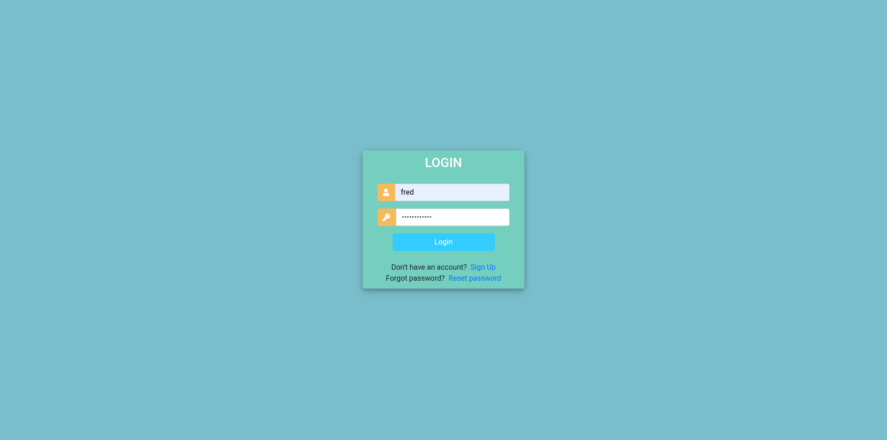
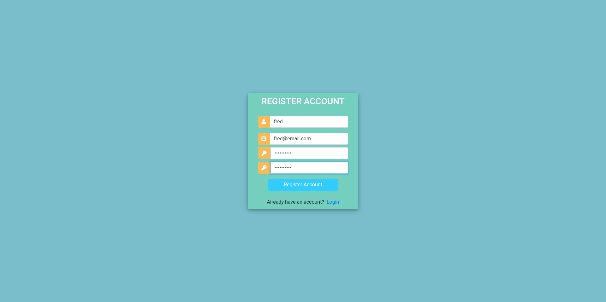
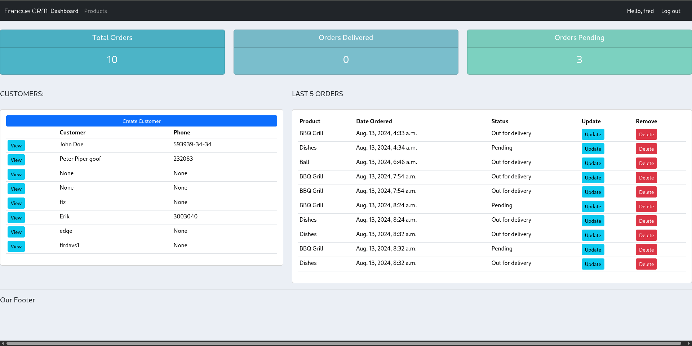
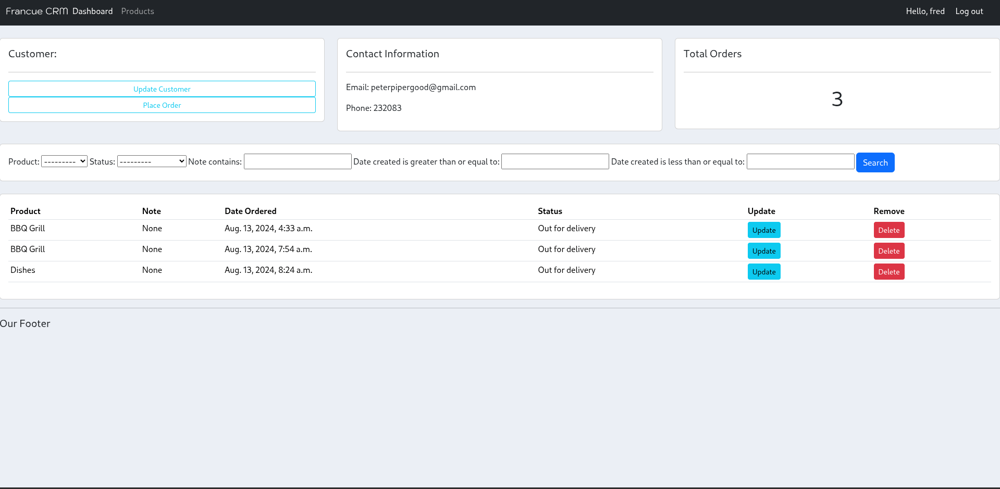
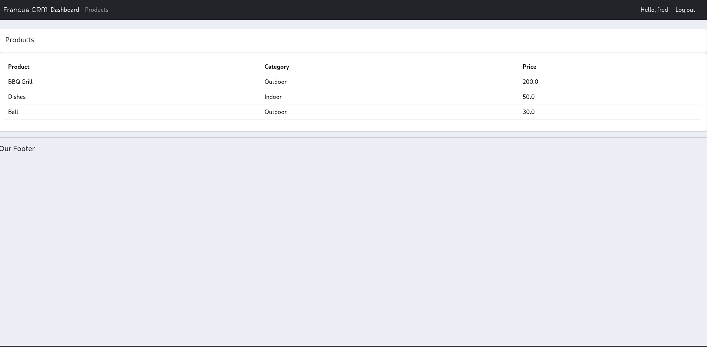
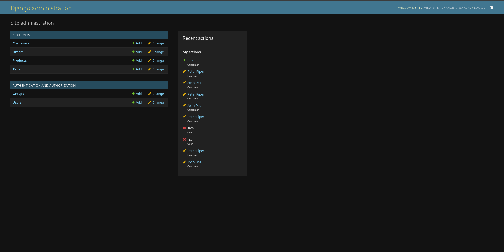

# CRM

A small Django CRM project for managing customers, products, and orders.

## What this project does

- User registration and login
- Admin and customer role separation
- Customer profile management with image uploads
- Product and order management
- Order filtering by date and note text
- Password reset screens
- SQLite for quick local setup

## Tech stack

- Python 3
- Django 4.2
- `django-filter`
- SQLite

## Project structure

```text
CRM/
├── accounts/
├── config/
├── static/
├── db.sqlite3
├── manage.py
├── requirements.txt
└── README.md
```

## Quick start

1. Clone the project and enter the folder.

```bash
git clone <your-repo-url>
cd CRM
```

2. Create and activate a virtual environment.

```bash
python3 -m venv .venv
source .venv/bin/activate
```

On Windows PowerShell:

```powershell
py -m venv .venv
.venv\Scripts\Activate.ps1
```

3. Install dependencies.

```bash
pip install -r requirements.txt
```

4. Apply migrations.

```bash
python3 manage.py migrate
```

This project now auto-creates the `admin` and `customer` groups during migration, so you do not need to create them by hand.

5. Create an admin account.

```bash
python3 manage.py createsuperuser
```

New superusers are automatically added to the `admin` group.

6. Start the development server.

```bash
python3 manage.py runserver
```

7. Open the app in your browser.

```text
http://127.0.0.1:8000/
```

## First-time usage notes

- Admin users can access the dashboard, products, customers, and order management pages.
- Regular users created from the register page are automatically added to the `customer` group and get a linked customer profile.
- Profile images are stored under `static/images/`.
- Password reset pages exist, but email sending is not fully configured by default. To make reset emails work, update the email settings in `config/settings.py`.

## Reset or clean the SQLite database

If you want to remove old records, including users, customers, orders, products, and tags, run:

```bash
python3 manage.py flush --no-input
```

What this does:

- Deletes existing data from the SQLite database
- Keeps your migrations intact
- Re-creates Django system data
- Re-creates the `admin` and `customer` groups automatically

After a flush, create a new admin account again:

```bash
python3 manage.py createsuperuser
```

If you want a completely fresh local database file instead, delete `db.sqlite3` and run migrations again:

```bash
rm db.sqlite3
python3 manage.py migrate
python3 manage.py createsuperuser
```

## Common commands

Run the development server:

```bash
python3 manage.py runserver
```

Create migrations after model changes:

```bash
python3 manage.py makemigrations
python3 manage.py migrate
```

Open the Django admin:

```text
http://127.0.0.1:8000/admin/
```

## Screenshots

### Login



### Sign up



### Admin dashboard



### Customer details



### Products



### Django admin



### Password reset


## Troubleshooting

- If `Pillow` is missing, image uploads will fail because the project uses `ImageField`.
- If static images do not load in development, confirm you are running the app with `DEBUG = True`.
- If password reset emails do not send, finish the SMTP configuration in `config/settings.py`.

## Running tests

Run the full Django test suite with:

```bash
python3 manage.py test
```

If you are using the project virtual environment, the typical flow is:

```bash
source .venv/bin/activate
python3 manage.py test
```

The current tests cover:

- default role group creation
- automatic customer profile creation for new users
- automatic admin group assignment for superusers
- basic registration and access-control flow
